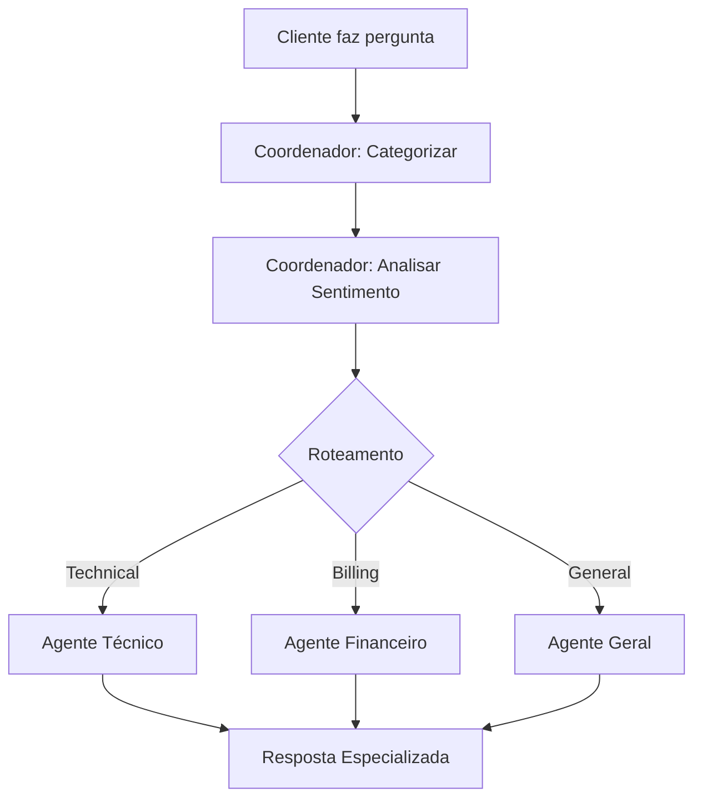

## Arquitetura

### Agentes Especializados

| Agente | Função | Especialidade |
|--------|--------|---------------|
| **Coordenador** | Análise inicial | Categorização + Sentimento |
| **Técnico** | Suporte técnico | Problemas de sistema, login, bugs |
| **Financeiro** | Questões financeiras | Cobrança, pagamentos, reembolsos |
| **Geral** | Informações gerais | Horários, contato, políticas |

### Fluxo de Processamento

O diagrama abaixo mostra o fluxo real gerado pelo LangGraph, demonstrando como as consultas fluem entre os agentes especializados.



## Como Usar

### 1. Configuração do Ambiente

```bash
# Clonar/baixar o projeto
cd src

# Criar ambiente virtual (recomendado)
python -m venv .venv
source .venv/bin/activate  # Linux/Mac
# ou
.venv\Scripts\activate     # Windows

# Instalar dependências
pip install -r requirements.txt
```

### 2. Configurar Variáveis de Ambiente

Crie um arquivo `.env` na pasta raiz (mesmo nível da pasta `src`):

```env
# OpenAI (obrigatório)
OPENAI_API_KEY=sua-chave-openai-aqui

# LangSmith (opcional - para observabilidade)
LANGSMITH_TRACING=true
LANGSMITH_ENDPOINT="https://api.smith.langchain.com"
LANGSMITH_API_KEY="sua-chave-langsmith-aqui"
LANGSMITH_PROJECT="nome-do-seu-projeto"
```

### 3. Executar o Sistema

```bash
# A partir da pasta src
python main.py
```

### 4. Ver Resultados

**No Terminal:**
```
DEMO SISTEMA MULTI-AGENTE
CASO 1: Não consigo fazer login no sistema
Categorizando consulta...
Categoria identificada: Technical
Processando com Agente Técnico...
Solução técnica gerada
```

**Visualização do Workflow:**
- O arquivo `graph/workflow_diagram.png` é gerado automaticamente
- Mostra o fluxo visual do sistema

**LangSmith (se configurado):**
- Acesse https://smith.langchain.com
- Veja traces detalhados de cada agente
- Analise performance e fluxos

## Personalização

### Adicionar Novo Agente

1. **Criar arquivo** em `src/agents/agente_novo.py`:
```python
class AgenteNovo:
    def processar_consulta(self, state):
        # Sua lógica aqui
        return {"response": "resposta", "agent_used": "Novo"}
```

2. **Modificar workflow** em `src/graph/workflow_suporte.py`:
```python
# Adicionar nó
workflow.add_node("agent_novo", self._processar_novo)

# Adicionar roteamento
if category == CategoryType.NOVA_CATEGORIA:
    return "agent_novo"
```

### Modificar Categorias

Edite `src/utils/state.py`:
```python
class CategoryType(str, Enum):
    TECHNICAL = "Technical"
    BILLING = "Billing"
    GENERAL = "General"
    NOVA_CATEGORIA = "NovaCategoria"  # Adicionar aqui
```